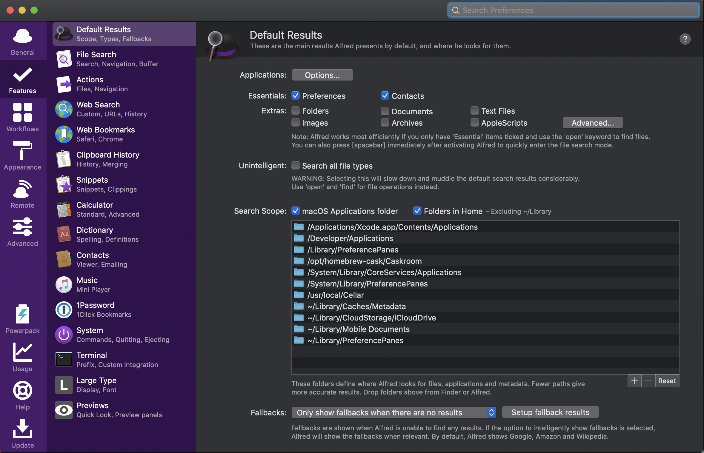
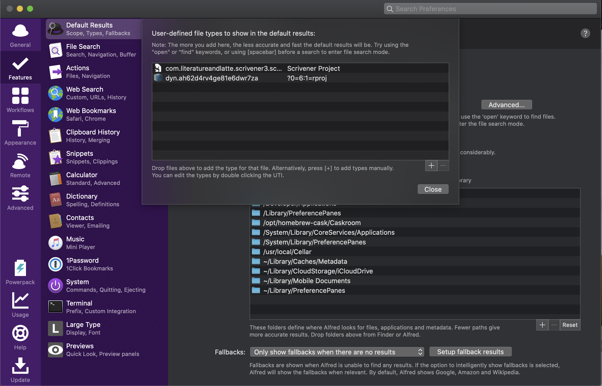

```{r setup, include=FALSE}
knitr::opts_chunk$set(echo = FALSE)
```

**TL;DR** add `dyn.ah62d4rv4ge81e6dwr7za` to `Preferences -> Features -> Default Results -> Advanced...` panel to add .Rproj as a user-defined file type.

# Overview
[Alfred](https://www.alfredapp.com/) app is a productivity app (in their words) for MacOS [^1] that does many many things. So far, I've just been using it's search functionality and am finding it quite sweet indeed (think Spotlight, but better). The use case here is that I want to avoid using my mouse to search for various Rstudio `.Rproj` files (i.e. in Finder).

# Hadley is god
I first came across this tip from Hadley Wickham in [this video](https://www.youtube.com/watch?v=boKFxBniUH0) - so you know it's good.

# Installing Alfred
Install Alfred from the [website](https://www.alfredapp.com/) or with [homebrew](https://brew.sh/) on the command line:  

```
brew install --cask alfred
```

# Configuring Alfred for .Rproj
Open Alfred and get into `Preferences -> Features -> Default Results` panel.  



Click on `Advanced...` and add the following user-defined file type (by clicking `+`)  

```
dyn.ah62d4rv4ge81e6dwr7za
```  



# Keyboard shortcut
I like to open Alfred with the keyboard shortcut <kbd>Cmd</kbd>-<kbd>space</kbd> instead of Spotlight. I followed the instructions [here](https://www.alfredapp.com/help/troubleshooting/cmd-space/) to do this.

Done! Now open Alfred with <kbd>Cmd</kbd>-<kbd>space</kbd> and start typing in the name of a `.Rproj` file. Note you can add other file types for Alfred to look for (e.g. Scrivener projects). A final tip is that if you press <kbd>space</kbd> before typing the file name, Alfred will search all files.

If you are looking for more Mac productivity tips, check out [this awesome Twitter thread](https://twitter.com/grrrck/status/1333804309272621060?lang=en) 

[^1]: Sorry Windows users. But there are other apps for Windows that do similar things.


