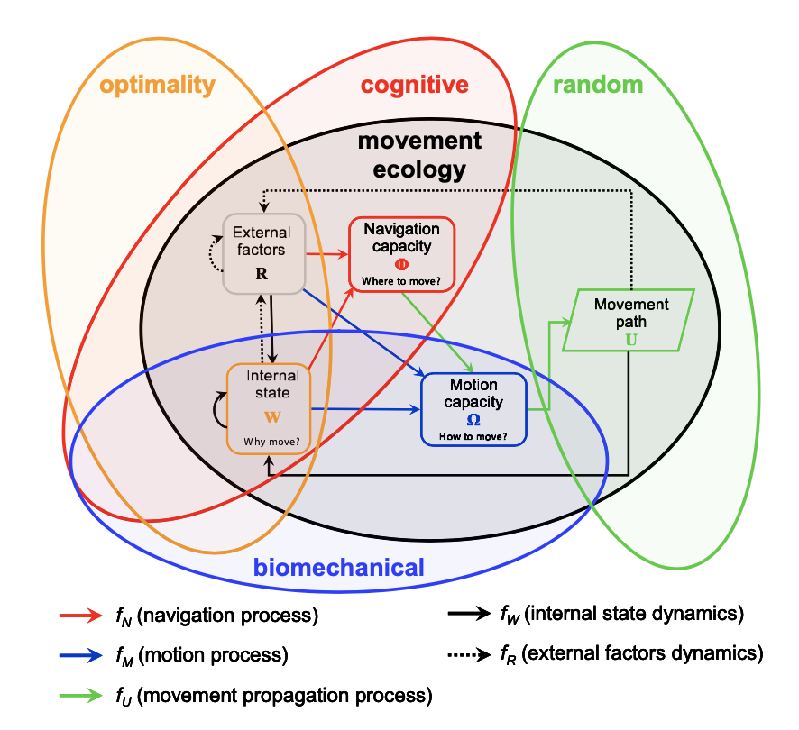
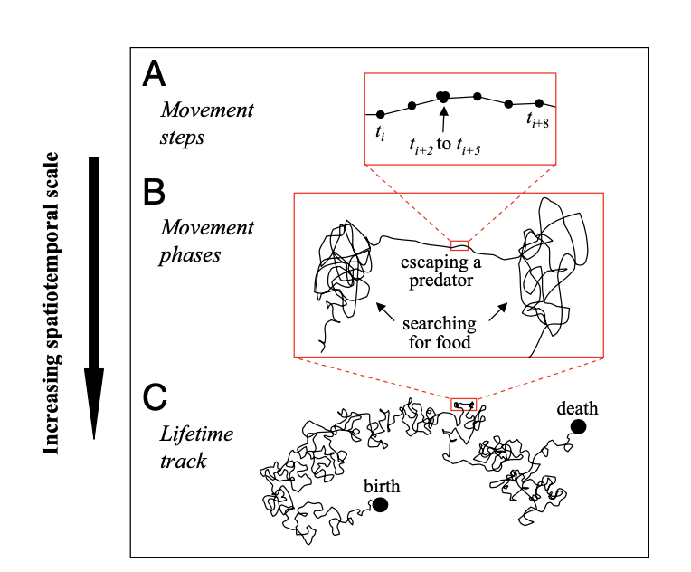

```{r setup, include=FALSE}
knitr::opts_chunk$set(echo = FALSE)
```

The study of animal movement has advanced a lot in recent years. Nathan suggests that advancements in animal tracking technology, environmental monitoring, and analytical methods (i.e. from increased computational power) have led to a general shift from the study of population redistribution (Eularian approach) to the study of individuals (Lagrangian approach). This has enabled development of more complex models (e.g. state-space models for individual animal movement) and increased understanding of movement ecology. However, Nathan suggests that a common framework is necessary to unify several paradigms for animal movement (i.e. biomechanical, cognitive, random, optimality) that are operating parallel to one another. 

In this attempt to unify the study of animal movement, Nathan's paper suggests that there are four overarching questions:  

1. Why do animals move?  
2. How do animals move?  
3. When and where do animals move?   
4. What are the external factors driving animal movement?   

Following from this, Nathan suggests that animal movement is a function of internal state (why), motion capacity (how), navigation capacity (when and where) and external factors (abiotic and biotic). In this formulation, the motion process and navigation process are both impacted by current location, internal state (i.e. physiological or neurological state affecting motivation and readiness to move) and external factors. The movement propagation process is the realized movement resulting from the motion process, which is optionally affected by the navigation process.



The result of this process is a lifetime movement track, which (at least partially) is observed by us. This track can be parsed into sub-units at various spatial and temporal scales. At a finer scale, movement paths can represent particular phenomena such as feeding or migrating. At even finer scales, movement steps might correspond to a few steps and a stop. Our ability to successfully identify movement phases depends on our ability to sample an individual's movement (i.e. sampling frequency, duration and protocol).



A major challenge in the study of fish movement from acoustic telemetry is that sampling frequency and duration is often limited. Movement tracks from stationary receivers typically have frequent and potentially large gaps in observed fish position in space and time. These gaps can occur when a fish is moving or resting between receivers, has died or emigrated outside of the receiver array, or has not been detected despite actually being present due to detection error. Note, however, that it is possible in some small study areas (e.g. small lake) to set up an acoustic telemetry array capable of collecting fine scale position data, allowing us to reconstruct a continuous track of an individual's movement (more akin to satelite temetry data).

Specialized statistical methods such as state-space models are required to uncover the ecological process of interest (e.g. spatial position) from typically noisy observation data. Hidden Markov Models are a class of state-space models useful for uncovering a finite number of states of interest (e.g., resident vs transitory states), which could correspond to 'movement paths'. Spatial capture-recapture models also have great potential for estimating distribution/density over time (i.e. as an animal's activity center, or collection of activity centers), taking into account detection error. 

In acoustic telemetry studies we are typically interested landscape or population ecology questions (e.g. distribution, density, survival), which typically involve relating the internal state (e.g., motivations for moving such as feeding, spawning) to external factors (e.g., water temperature, discharge). Nathan places this type of research in the 'optimality' paradigm. 

However, the utility of Nathan's framework is to force us to more comprehensively think about different drivers of fish movement in our models. In order to interpret our results, inform our study design, or place constraints on our model predictions, we need to consider motion capacity and navigation capacity of the animal being studied. This information can be drawn from biomechanical and cognitive paradigms of animal movement research. For example, understanding of motion capacity might inform us whether a fish is incapable of swimming in certain conditions (e.g., high flow, extreme water temperature). Understanding of navigation capacity might inform our understanding of what time of year a fish is going to migrate. One technology with great potential for improving our understanding the motion process are Data Storage Tags, which can measure physiological information as a fish moves (heart rate, muscle activity, acceleration) along with environmental conditions (e.g., water temperature).

Through advancements in technology (e.g., tracking technology, collection of physiological/environmental data), statistical methods (e.g., state-space models spatial capture-recapture), and incorporating our understanding of navigation and motion capacity of fish, there is great potential for Nathan's framework to improve the study of fish movement from acoustic telemetry data.


