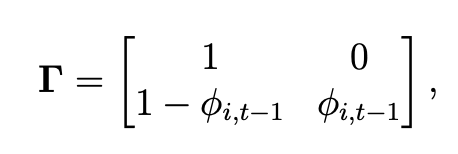

```{r setup, include=FALSE}
knitr::opts_chunk$set(echo = FALSE)
```

# A big picture look at Hidden Markov Models 
Hidden Markov Models (HMM) can be used for ecological time series data to uncover hidden ecological states [@McClintock.2020f5m]. They are gaining popularity in ecology, where they have been frequently used to model capture-recapture data (e.g., for survival rate estimation via Cormack Jolly-Seber model) and animal movement data to investigate behavioural states in animals that exhibit distinct beavioral modes (e.g., resident vs transient)[@Auger-Méthé.2020]. 

Broadly speaking, HMMs are heirarchical models. Slightly more specifically, HMMs can be classified as Hidden Process models, where a model for the state process (i.e., the hidden ecological state of interest) is coupled with a model for the observation process [@King.2013]. Even more specifically, HMMs are a special case of state-space model (SSM) with a discrete and finite number of states in the process model. In these models, the state process is not directly observed; rather it is a hidden (or latent) variable. The observations (e.g., from telemetry or capture-recapture), which make up the observation model, are generated by the underlying state process but are 'noisy' measurements that are insufficient when considered alone to determine the state.  

These models can be complex and are most sensibly used when one would expect high variance in the process and high observation error. However, [@Auger-Méthé.2020] argues that SSMs (and HMMs by extension) should be the default statistical modeling technique for all ecological time series data. 

# Tell me more...
HMMs have two main characteristics:  

1. Each observation is assumed to be generated by the distribution of one of a set of possible states. The state assigned to the observation at time *t* is directly dependent on the state at time *t* and is independent of the states or observations at any other times (known as conditional independence).  
1. The sequence of states is modeled as a Markov chain, where the probability of being in a state at time *t* is directly determined by the state at time *t - 1*.  

An HMM is specified with three major componenets:   

1. **intitial distribution** - a vector of probabilities for each state at the start of the time sequence.  
1. **state transition probabilities** - a matrix of probabilities for switching from any state at time *t* to another state at time *t + 1*.    
1. **state-dependent distribution** - probability distribution of an observation conditional on the state at time *t*. This depends on the form of the observed data, e.g. count data are poisson distributed, positive continous data may be gamm distributed, etc.  

A model can be fit using Maximum Likelihood or Bayesian methods. 

# Application of HMM to fish movement

[@McClintock.2020f5m] provides a number of examples for application of HMMs to the existential, developmental and spatial states of animals at the level of individual, population, or community. Here are a few examples that could be useful for understanding fish movement/behaviour at the individual level from capture-recapture and acoustic telemetry data.

### Survival
We can estimate surival (an existential question) using the Cormack-Jolly Seber model, with 2 states (alive and dead). 

```{r survival, echo=FALSE, fig.cap="Specification for a survival HMM [@McClintock.2020f5m]", preview=TRUE}
knitr::include_graphics("survival-hmm.png")
```

The transition probability matrix is rather simple in this case (Figure 2): probability of staying dead is 1; the probability of coming back to life once dead is 0; the probability of dying is the probability of not surviving (1 - survival rate); and the probability of surviving is equal to the survival rate.

```{r transition, echo=FALSE, fig.cap="Transition probability matrix for CJS HMM survival model [@Auger-Méthé.2020]", preview=FALSE}

```

### Behavioural mode
In order to investigate whether a fish is in one of several possible behavioural modes, we can extend the survival HMM above to include multiple states (e.g., 'alive and breeding', 'alive and non-breeding', 'dead').  This could help us to identify, for example, migratory phases, predation/feeding events, or hibernation/overwintering cycles. 

In multi-state models of animal movement, observations are typically expressed as a bivariate sequence of step-length (Euclidean distance) and turning angle. A hypothetical two-state model might consist of 'resident' and 'transient' states, where movements in the 'transient' state have longer step-lengths and more persistent turning angles and movements in the 'resident' state have smaller step-lengths with frequent changes in turning angle.  Step-length is typically modeled with a gamma or Weibull probability distribution and turning angle is typically modeled with a von Mises or wrapped Cauchy distribution. 

The number of states to select may not be clear *a priori* and can be selected based on biological understanding and possibly, via model selection. The state transition probabilities are also not predetermined, but are freely estimated by the model. 

![Specification for a multi-state behaviour HMM with bivariate observation process [@McClintock.2020f5m]](behaviour-hmm.png)

### Spatial location
We can predict movement to or from specific spatial locations, where each state corresponds to a site (e.g. spawning vs overwintering site). This follows the same model specification as the above behaviour example, but the observations are univariate site locations (e.g. A, B, and 0, where A and B might correspond to a spawning site and overwintering site, respectively, and 0 is unknown location). State transition probabilities in this case are interpreted as probability of fidelity/dispersal. In this case, we could use the model to predict specific location at times in the observation sequence where location is unknown. Note, a state-space model or spatial capture-recapture model may be more appropriate in this case for estimation of location or activity center in conitnuou spaceK. 

![Specification for a spatial HMM where observations correspond to a site [@McClintock.2020f5m]](spatial-hmm.png)


