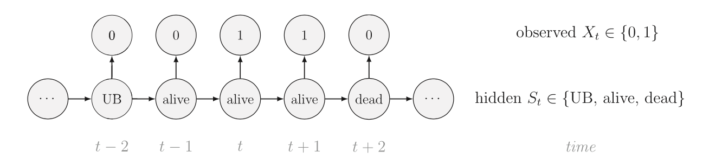
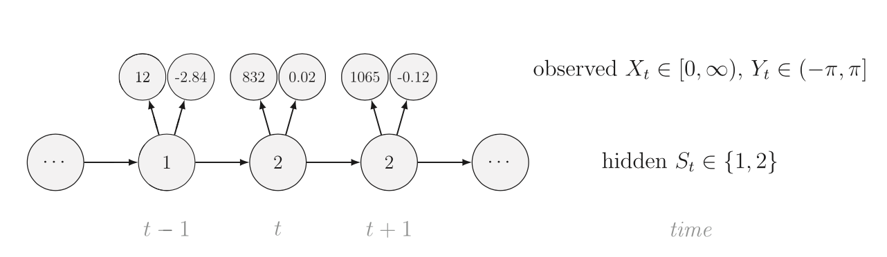
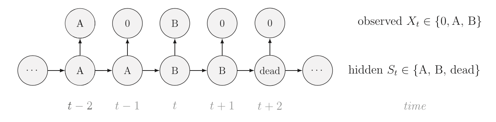

```{r setup, include=FALSE}
knitr::opts_chunk$set(echo = FALSE)
```

# What is a Hidden Markov Model
Hidden Markov Models (HMM) can be used for ecological time series data to uncover hidden ecological states. They do this by disentangling the observation process from the underlying (unobserved) state process. One important use for HMM is in movement ecology, where we can classify an animal's movements into several modes (state) which help us to understand aspects of behaviour, physiology, resource selection, etc. 

A Hidden Markov Model (HMM) is a special case of a state-space model that has a finite number of hidden states. A HMM is a heirarchical model consisting of a model for the observation process (state-dependent) and a model for the state process.The state process is not directyl observed; rather it is a hidden (or latent) variable. The observations (e.g. telemetry or capture-recapture data) are generated by this underlying state process. The observations are considered noisy measurements and are insufficient alone to determine the state. 

HMMs have two major simplifying assumptions, one each for the state process and observation process. A major assumption for the state process is he Markov property - the probability of a state being active at time t is dependent on the state at time t - 1. A major assumption for the observation process is conditional independence - the probability distribution of an observation at time t is completely dependent on the state at time t (and is independent of any other states or observations). 

A HMM is specified with three major componenets:   

1. the intitial distribution - a vector of probabilities for each state at the start of the time sequence.  
1. state transition probabilities - a matrix of probabilities for switching from any state at time t to another state at time t + 1.    
1. state-dependent distribution - probability distribution of an observation conditional on the state at time t. This depends on the form of the observed data, e.g. count data are poisson distributed, positive continous data may be gamm distributed, etc.  

A model can be fit using Maximum Likelihood or Bayesian methods. 

# Application to fish movement

An HMM can be applied to a wide variety of questions existential, development at and spatial states at the level of individual, population, community or ecosystem. Here, I'm going to explore three potential applications for understanding fish movement/behaviour at the level of individual from capture-recapture and acoustic telemetry data.

## Survival
We can estimate surival (an existential question) using the Cormack-Jolly Seber model, with 2 states (alive and dead),where the probability of transitioning from dead to alive is set at 0. In order to explore behaviours, we can extend the 'alive' state into multiple states, e.g. 'alive and breeding', 'alive and non-breeding'. 



## Behavioral state (or movement phase)
Disentangling multiple states from animal movement data can help to identify, for example, migratory phases, predation/feeding events, or hibernation/overwintering cycles. In these multi-state models of animal movement, observations are typically expressed as trajectories in 2-dimensional space, i.e. bivariate sequence of step-length (Euclidean distance) and turning angle. A two-state model could consist of 'resident' and 'transient', where movements in the 'transient' state correspond to longer step-lengths and more persistent turning angles. Step-length is typically considered to follow a gamma or Weibull probability distribution and turning angle is typically modeled with a von Mises or wrapped Cauchy distribution. The number of states in these types of models are typically not clear a priori and therefore need to be selected given biological understanding and possibly, model selection. The state transition probabilities are also not predetermined, but rather are freely estimated by the model and are completely data-driven. 



## Spatial location
We can predict movement to or from specific spatial locations, where each state corresponds to a site (e.g. spawning vs overwintering site). This follows the same model specification as the above behaviour example, but the observations are univariate site locations (e.g. A, B, 0 or unknown) and state transition probabilities are interpreted as fidelity/dispersal. In this case, we could use the model to predict location at times in the observation sequence where location is unknown. 



