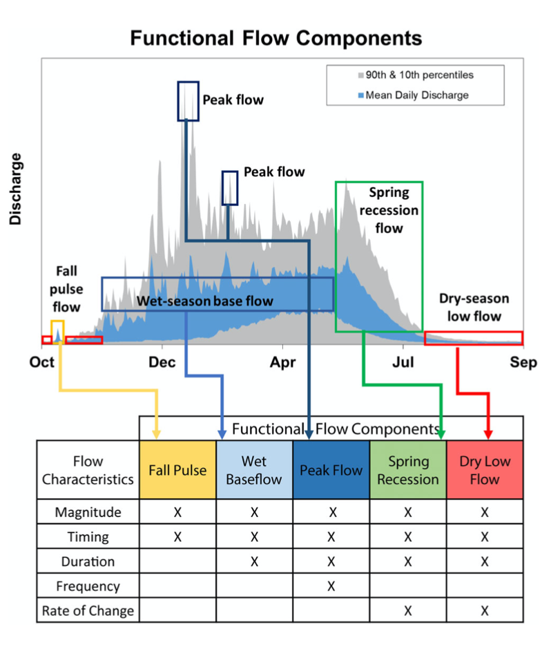

```{r setup, include=FALSE}
knitr::opts_chunk$set(echo = FALSE)
```

We know that river flow is a (the?) major driver of riverine ecosystem processes. It therefore makes sense to include some measurement of river flow in our regression models when relating to some aspect of a species existence that we are inteerested in (e.g. abundance, spwning success, movement). This seems straightforward. However, there are so many ways that we can measure a river flow!




