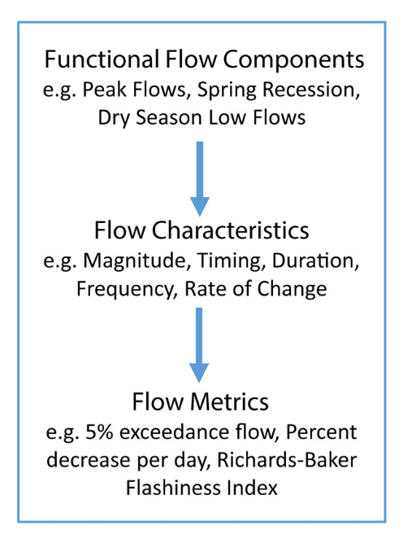
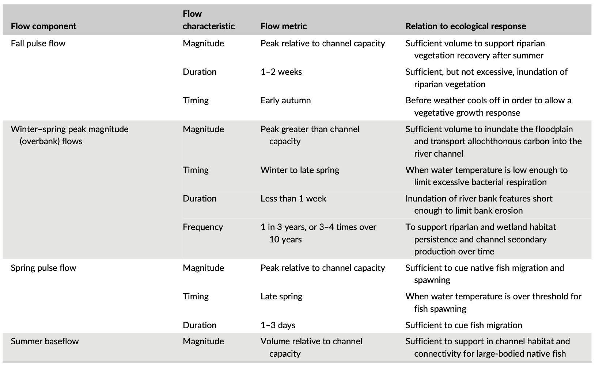
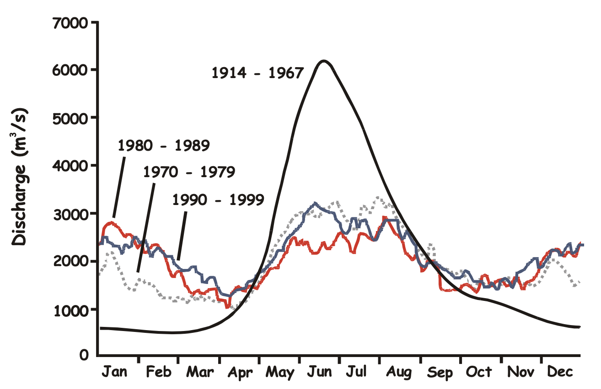

```{r setup, include=FALSE}
knitr::opts_chunk$set(echo = FALSE)
```

We know that flow is a major driver of river ecosystem processes. However, when investigating the relationship between some ecosystem response (e.g., fish abundance, fish spawning/migration) and river flow, we need to be explicit about what aspect of the flow regime we are looking at (e.g., time of year, magnitude), how it is measured, and what is known about the underlying biological mechanism/ecosystem process that each flow component is affecting. This is not a simple task as there are many possible flow metrics. For example, @Olden.200372 describe 171 'hydrologic indices' developed and applied by researchers to characterize different aspects of a flow regime. 

# Functional flows approach
@Yarnell.20208x provide a useful conceptual model for selecting ecological relevant flow metrics. The 'functional flow approach' consists of functional flow components, functional flow characteristics and functional flow metrics. 

1. First, a literature review is done to identify **functional flow components**, which describe aspects of the annual hydrograph that are most important to sustaining ecological, geomorphic, or biogeochemical processes.
1. Selected flow components are described by **functional flow characteristics**, such as magnitude, timing, duration, frequency, or rate of change.
1. Flow characteristics are measured by quantifiable **functional Flow metrics** (e.g., 5% exceedance flow), which provide the data we can use in our models.  

```{r ff-approach, echo=FALSE, fig.cap="Conceptual model for functional flows approach [@Yarnell.20208x].", preview=FALSE}

```

The emphasis in this approach is to select metrics based on demonstrated links (i.e., from the literature) to specific aspects of aquatic/riparian community or species-specific functioning. This is preferred over using statistical methods to test strength of relationship to all (or many) possible metrics. In the case where detailed knowledge of linkages are unknown or incomplete, @Yarnell.20208x suggests selecting metrics that capture the full range of characteristics for each flow component.

# Some examples
Figure 2 shows an example of flow components and respective flow characteristics for a mixed rain-snowmelt runoff system in California, which is defined by seasonal high and low flows. The annual hydrograph has 5 flow components (fall pulse, wet baseflow, peak flow, spring recession and dry low flow), each of which can be characterized by some combination of magnitude, timing, duration, frequency, rate of change. Peak flow, for example, is the only component with frequency as flow characteristic since it is not a one-time annual event event. 

```{r ff-components, echo=FALSE, fig.cap="Functional flow components in a seasonal river [@Yarnell.20208x].", preview=TRUE}
knitr::include_graphics("functional-flow-components.png")
```

The table below shows an example of flow metrics and specific links to some ecological function in an Australian river. For example spring pulse flow magnitude, measured as the peak relative to channel capacity, is important to cue native fish migration and spawning.

```{r ff-table, echo=FALSE, fig.cap="Functional flow components and metric linked to ecological response Goulburn River, Australia [@Yarnell.20208x].", preview=TRUE}

```

The overall idea presented in the functional flows approach is to capture spatiotemporal complexity in the river flow regime with a finite set of metrics that have demonstrated links to specific ecosystem processes.

# Regulated rivers
In regulated rivers, it may also be useful to identify flow metrics that can possibly be, or reasonably be manipulated. Comparing differences between the natural flow regime with the regulated flow regime across important flow components and metrics and how those aspects of the natural regime sustain ecosystem processes is also very useful to identify impacts of river regulation.  

For example, Figure 4 shows the natural seasonal flow regime (discharge) for the Upper Columbia River pre-river regulation and at various stages post-river regulation. Here we can see that two main flow components have been heavily altered: high flow spring freshet is reduced ost-river regulation and low flow period in the fall/winter is increaed. These changes have been linked in the literature to White Sturgeon recruitment failure as natural spring freshet is known to provide behavioral cues for spawning and is important for rearing habitat (i.e., to prevent fine materials from  clogging interstitial spaces in substrate important to larval life stage) [@Hildebrand.2013].

```{r col-flow, echo=FALSE, fig.cap="Upper Columbi River discharge per and post-river regulation [@Hildebrand.2013].", preview=TRUE}

```
