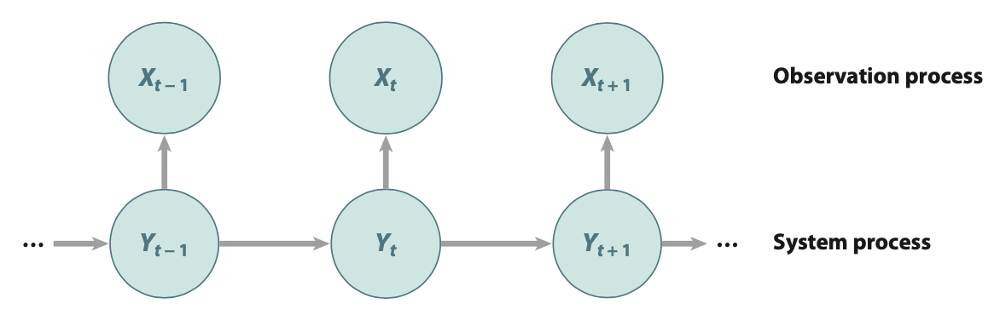

```{r setup, include=FALSE}
knitr::opts_chunk$set(echo = FALSE)
```

# Which model is it?
I'll be honest, I was initially confused as I read @Dorazio.2019hq as to what kind of modelling approach was being used. 

Reading the title  

> "State-space models to infer movements and behavior of fish detected in a spatial array of acoustic receivers"

it is clear State-Space models (SSM) are used.

Reading a section of the abstract

> "In these models, fish movements and behavior switching are specified using a hidden Markov model of the changes in an individual’s latent activity center"

it is clear that a Hidden Markov Model (HMM) is used, and reference to "an individual's latent activity center" leads me to think that this is a Spatial Capture-Recapture (SCR) model, although the term "spatial capture-recapture" is not present in the paper.

So what is going on here? Is it all of these things? 

This may already be clear to you, but the answer is yes, it is all of these things. 

# Hidden process models

According to @King.2013, many ecological models have developed independently, leading to different terminology. A group of these models (termed *hidden process models*) all couple a system process describing the underlying hidden biological process of interest (e.g., behavioural state, spatial location) with an observation process (i.e., the actua data measured). The observed data are conditionally independent given the underlying states. Since multiple models are combined, these can broadly be classified as heirarchical or generalized linear mixed models [@Whoriskey.20198je].

```{r hidden, echo=FALSE, fig.cap="A graphical representation of a hidden Markov model (HMM) or state-space model (SSM) where Y1 , Y2 , . . . , YT denote the underlying system process and X1,X2,...,XT denote the corresponding observation process [@King.2013].", preview=TRUE}

```


# HMM + SSM
HMM and SSMs are both hidden process models that are very closely related. Kim Whoriskey provides further clarity in her PhD thesis, with reference to @Auger-Méthé.2020:  

> "Despite their separate developmental histories, HMMs and SSMs are both hierarchical models wherein the observations are dependent upon a set of unobserved variables - random effects, or states - that follow a Markov process, and the literature appears to have converged around the viewpoint that HMMs are special cases of SSMs with discrete latent states" 

We can therefore make the following distinction:   

- **HMM** - unobserved random effects (latent states) are discrete  
- **SSM** - unobserved random effects (latent states) are continuous  

In animal movement studies, SSMs are generally used to predict spatial location, whereas HMMs are used to predict discrete behavioural states. Switching models can be used to predict location and behaviour simultaneously, thus enabling us to account for location error (if it exists) and estimate behavioural state from the corrected locations [@Jonsen.2013]. This is better than simply using predicted location as a response variable in a second model (HMM) because it is able to include the uncertainty in location prediction in estimates of behavioural state.

# Where does SCR fit in?
SCR methods are catered toward a specific kind of ecological data - spatial encounter histories of individuals - which are generated from trapping grids or similar sampling technologies (e.g., acoustic telemetry arrays). In 'typical' SCR studies to date, an individual's activity center (i.e., expected location) is assumed to be static throughout the study period. We can modify this model to investigate movement or dispersal by coupling a latent movement model (e.g., simple Markovian movement model or correlated random walk) with the spatial encounter model to look at change in activity center over time. In this formulation, the SCR model is characterized as a SSM or HMM.

# Bringing it home

Coming back to @Dorazio.2019hq, we can say that this is a SCR movement model (i.e., it is estimating shift in activity centers over time) that couples a latent movement model (correlated random walk) with the spatial encounter model. It is also an HMM, which we now know is a special case of an SSM with a discrete latent variable (resident vs transient behavioural state). Even more broadly, it is a hidden process model. They're all hidden process models!


