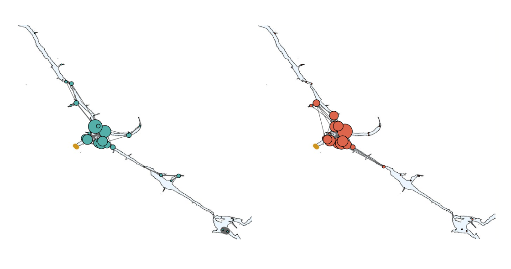
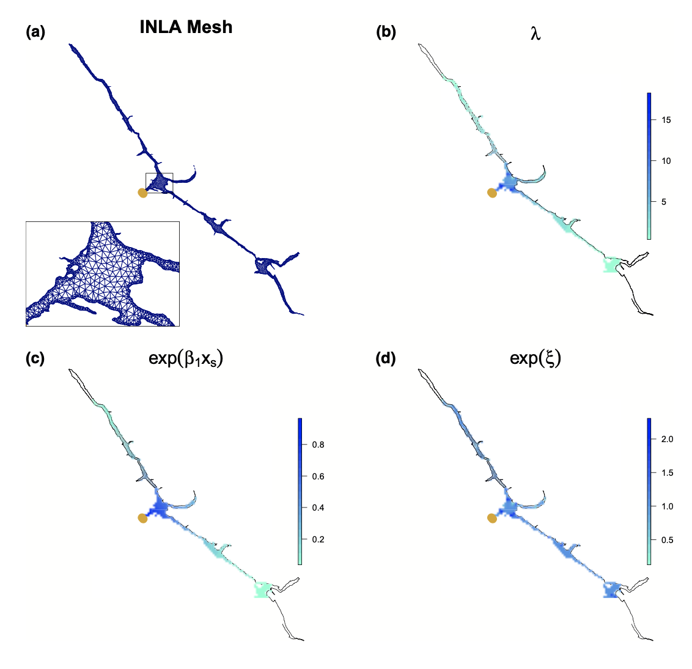
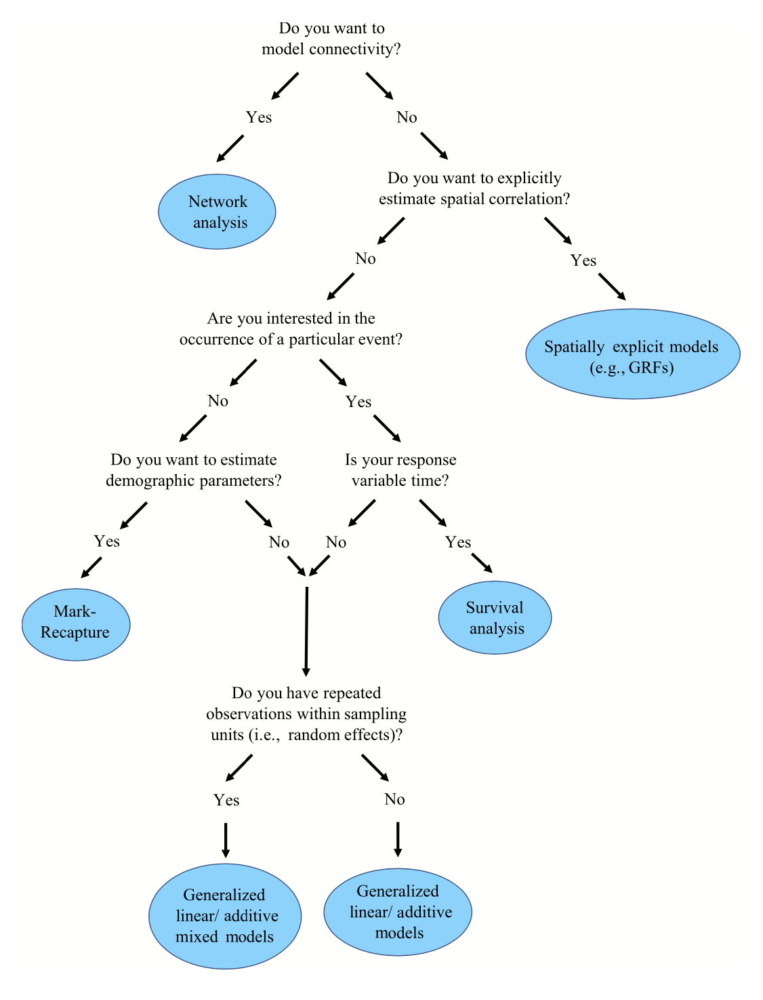

```{r setup, include=FALSE}
knitr::opts_chunk$set(echo = FALSE)
```

It's a pretty exciting time to have telemetry data! Technology is advancing rapidly, the quantity and size of datasets is growing, and important questions are being answered that improve our understanding and management of aquatic species. However, statistical methods used to analyze these data are not keeping up with the pace of progress, as analyses are often descriptive and lacking quantitative rigor. [@Whoriskey.20198je] outlines some of the current and emerging statistical methods to analyze telemetry data and improve this growing field.

Note that the paper does not review methods for spatially continuous data (e.g., GPS data) and focuses on telemetry from fixed receiver station, a method that is gaining popularity for the study of aqautic animals. These data (referred to as 'detections') basically consist of unique ID of fish (transmitter), timestamp of detection, and receiver ID (which can be linked to a fixed location via receiver deployment information).

# Which statistical method?
The choice of statistical method depends on the question of interest and the study design (e.g., spatiotemporal design of receiver deployment). The paper reviews 4 main methods: generalized modelling framework, survival analysis, capture-recapture models, and network analysis. Depending on the method, raw detection data will have to be summarized in some way to create the appropriate response variable (e.g., total detections/receiver/time period, residence, movement rate). Generation of these metrics (as well as generation of descriptive statistics and data visualizations) is faciliated by the [actel R package](https://rdrr.io/github/hugomflavio/actel/man/actel.html).

## Generalized modelling framework
Generalized modelling framework includes Generalized Linear Models (GLM), Generalized Additive Model (GAM) and Generalized Linear Mixed Models (GLMM). All of these are regression models (at increasing levels of complexity) that can be used to relate some response variable *y* to a set of putative explanatory covariates.

With a GLM, we can model response variables that are not Gaussian-distributed (e.g., Poisson, Binomial) to a set of categorical or continuous covariates and a monotonic link function. Since detection data often have a large number of absences (i.e., no detection at receiver in given time period), zero-inflated models may be appropriate.

GAMs are useful when there is a nonlinear relationship between the response and covariates as they use smoothing functions. GLMMs are useful when it is necessary to account for variation within and among sampling units (i.e., random effects). For example, if individual ID is modelled as a random effect each unique individual could have a different intercept and/or slope. Random effects could also account for spatial/temporal dependence (i.e. sampling location or year)

## Survival analysis
With survival analysis, we are interested in estimating the time it takes for an event to happen. This could be death, but also migration events, passing through obstacles, interacting with humans, and more. this is done by extending the response of a binomial GLM (event happened vs event didn't happen) with a survival function that determines the probability of an event happening at some time. Kaplan-Meier and Nelson-Aalen are common survival function estimators.

## Mark-recapture models
With mark-recapture, we capture and recapture individuals to generate an encounter history sequence, which is useful for estimating movement or population demographic parameters like survival or abundance. In acoustic telemetry, each detection event can be considered a recapture event. an important distinction to make in comparison to conventional mark-recapture data is that only tagged animals are monitored. Known-fate (no detection probability), live-recapture (detection probability), and recovery (recapture is terminal) models are useful for these types of data. 

The Cormack Jolly-Seber (CJS) model is a useful live-recapture model for estimating apparent survival. Apparent is a necessary caveat here as it cannot be known whether a fish died or emigrated. A CJS model estimates two parameters: φ, the probability that a fish survived and p, the probability that a fish was detected if alive and marked. The multi‐state Arnason–Schwarz model is an extension to CJS allowing where survival and detection probability vary according to an observed state (see also Hidden Markov Models).

## Network analsyis
Networks consist of nodes and edges, where node degree (number of incoming/outgoing edges) and edge density (number of edges/total possible edges) are metrics calculated from the data. Movement can be studied when receivers are represented by nodes and movement between receivers as edges. In this case, node degree represents total receiver traffic and may indicate an important or highly used area. If unique fish are treated as nodes, we can study social aggregation (i.e., preferred associations between fish). 

Networks are very useful for visualization, where for example node degree can be visualized as circle size and edge density as line width. Nodes can be shown on a map in their actual location (Figure 1) or as a plot untethered from the real world location. Hypotheses can also be tested using GLMMs (i.e., with network matrix as response variable) or with non-parametric methods (e.g., to compare a network with a randomly generated network).

```{r network, echo=FALSE, fig.cap="Example of network analysis output [@Whoriskey.20198je].", preview=TRUE}

```

# Future directions
[@Whoriskey.20198je] offers some interesting emerging methods:  

- **Gaussian Random Fields** may be useful for understanding spatial context by estimating residual spatial correlation from remaining variation after explanatory covariates are considered. For example in figure 2 we can see in panel D the expected number of fish after the effect of other model covariates (distance from dam; panel c) are taken into account.  
- **Spatial Capture-Recapture** (SCR) is an exciting extension to mark-recapture methods that fully taking advantage of the spatial component of individual encounter histories by modeling latent activity centers as a spatial point process. Although SCR has been used fairly extensively in terrestrial studies but not yet in aquatic studies with acoustic telemetry data.  
- **State-Space Models** (and Hidden Markov Models) are heirarchical models that estimate both the state process (e.g., model for animal movement) and the observation (or measurement) process together. These could provide a useful and general framework for analysis of detection data and are already being used in studies of continuous animal movement data fairly frequently.
- general improvement and uptake of methods for handling **spatial autocorrelation**
- general improvement and uptake of methods for dealing with **measurement error** (e.g., variation in detection of range of receivers), which can either be used to preprocess data or directly incorporated into model structure. 

```{r grf, echo=FALSE, fig.cap="Example of Gaussian Random Fields analysis [@Whoriskey.20198je].", preview=TRUE}

```

So which method to choose? [@Whoriskey.20198je] provides a handy tree diagram to help (Figure 3). In summary: use mark-recapture methods for population dynamics; survival analysis to estimate time to an event (e.g., survival where the response variable is a unit of time rather than presence/absence); network analysis to describe connectivity between receivers or individual fish; GRFs to investigae spatial correlation; and a generalized modeling framework (GLM/GAM/GLMM/GAMM) for basically any other purpose when relating a response variable to some set of putative explanatory covariates.

```{r tree, echo=FALSE, fig.cap="Decision tree for selecting a statistical method to analyze telemetry detection data [@Whoriskey.20198je].", preview=FALSE}

```
