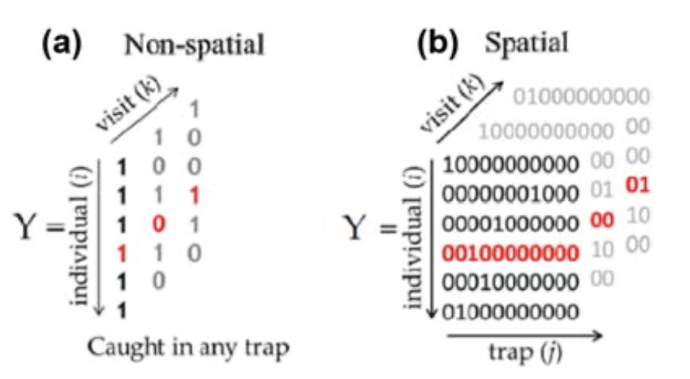
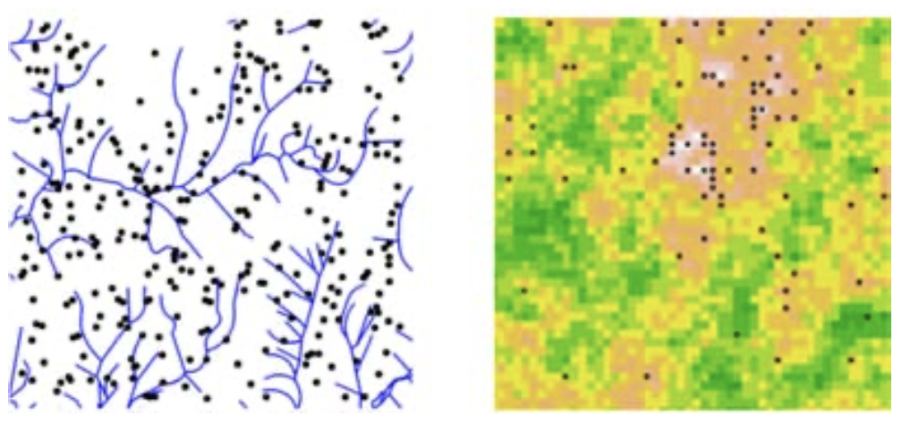
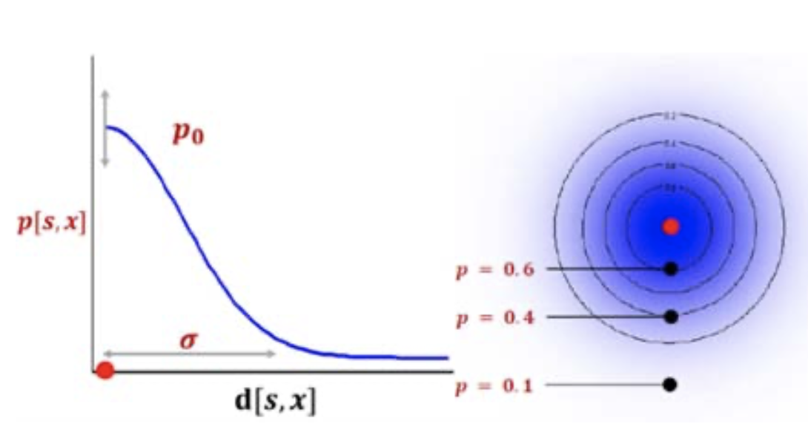

```{r setup, include=FALSE}
knitr::opts_chunk$set(echo = FALSE)
```

*Note, this post draws heavily from [@Royle.2018z84]*

# Unifying population and landscape ecology
Population ecology is concerned with animal movement, demographic rates (e.g., growth rate, survival rate) and variation in population size/structure. It is traditionally not concerned with the effects of within-population spatial processes on populations. 

In reality, population dynamics in space and time are driven by the structure of the landscape. Landscape ecology is concerned with linking ecological processes to landscape structure (e.g., landscape connectivity, resource selection functions). However, landscape ecology studies typically focus on individuals, without formally taking into account how individuals are sampled from a population and therefore without the ability to make inferences about the population. 

Capture-recapture (CR) methods have become the cornerstone of population ecology. They allow us to make inferences about populations when we are only able to observe a small fraction of individuals, at a limited number of locations and points in time. However, CR methods are disconnected from spatial structure, reducing sampled spatial encounter histories to sequences of observed/not observed, irrespective of which trap the individual was observed at. This eliminates the possibility to study important ecological questions such as within-population spatial structure (i.e., population density).

Spatial capture-recapture (SCR) aims to rectify this shortcoming in CR methods and unify aspects of population and landscape ecology. With SCR, we can answer spatial ecological phenomena such as density, movement, landscape connectivity and resource selection. This allows us to 'downscale' our understanding of population structure, i.e., at finer scales, rather than as broad-scale summaries. 

# Density as a motivating example
Density is a population state of interest in most animal monitoring studies. When we try to estimate population abundance or density from closed-population CR methods that are not spatially-explicit, we run into two major issues:  

1. It is difficult to estimate density (population abundance/area) when we cannot precisely define the area that we've sampled and when individuals can move in and out of the sample region.    
1. The probability of sampling an individual varies by device and location (e.g., individuals at outer edge of sampling grid have lower probability of capture).  

# A Spatial Capture-Recapture model
To address this we use a Spatial Capture-Recapture model, which is a heirarchical model consisting of spatial encounter history data, spatially explicit point process model, and an encounter probability model:  

1. **spatial encounter history data** - a 3-dimensional dataset with information on whether an individual was observed (or not) at specific trap locations in time (Figure 1).   
1. **spatially explicit point process model** - it assumed that each individual in a population has an activity center, which is expressed as 2-d coordinates (or 1-d coordinate along a line, e.g., a river) and the collection of activity centers is the realization of a spatial point process. The spatial point process is described by a distribution function which determines how individuals are distributed in space. For example, a simple spatial point process assumes that activity centers are distributed uniformly in space. More complex distribution functions may incorporate covariates (e.g., forest cover, stream network; Figure 2).  
1. **encounter probability model** - We can model encounter histories as bernoulli outcomes with probability of encountering an individual at each trap/time combination. The probability is a detection probability, which is a function of the Euclidean distance between the trap and an individual's latent activity center. Typically this function follows a half-normal distribution (Figure 3).  

```{r hidden, echo=FALSE, fig.cap="Non-spatial encounter history data vs. spatial encounter history data [@Royle.2018z84].", preview=FALSE}

```
```{r point-process, echo=FALSE, fig.cap="Point process distribution of activity centers with covariates [@Royle.2018z84].", preview=FALSE}

```

```{r half-normal, echo=FALSE, fig.cap="Half-normal encounter probability [@Royle.2018z84].", preview=TRUE}

```

A SCR model therefore estimates three parameters:  

- **p0** - probability of encountering an individual at it's activity center  
- **σ** - rate at which detection probabilit declines as a function of distance  
- **D** - density as the number of activity centers per unit area of S (the state-space)  

# How can SCR be applied to acoustic telemetry data?

Acoustic telemetry data is similar to capture-recapture data collected from, e.g., terrestrial sampling devices like hair snares or traps. As such, methods developed in the terrestrial capture-recapture literature are typically more applicable to acoustic telemetry than, for example, methods developed for satelite telemetry (with knowledge of continuous movement in time).  In both acoustic telemetry and terrestrial trapping, unique individuals are identified at stationary and continuously monitored traps (or acoustic receivers), providing a spatial encounter history for each individual.

One key difference in acoustic telemetry data is that information is only collected from tagged (sampled) individuals, limiting our ability to make inferences about the population (e.g. population size). However, these data can be supplemented with general capture-recapture data of both tagged and non-tagged individuals (e.g., from fishing) to make population-level inferences. 
Few examples of applications of SCR to acoustic telemetry exist to date. In general, acoustic telemetry technology appears to be advancing faster than the statistical methods required to analyze the data they produce. As a result, acoustic telemetry studies investigating spatial ecological phenomena typically resort to descriptive statistics, data summaries and data visualizations, which lack quantitative rigor [@Raabe.2014996]. 

One typical use for acoustic telemetry data (especially for freshwater fisheries) is to estimate demographic parameters such as survival using more traditional CR methods. These demographic rates are very useful for management of freshwater fish populations, but fail to take advantage of the spatial information in spatial encounter histories. Using SCR methods, we can study spatial ecological phenomena like distribution, density, movement, landscape connectivity and resource selection. 

This may require extension of SCR modeling methods outlined above. For example, a basic SCR model (e.g., to estimate density) assumes an individual's activity center is static throughout the study period. To investigate movement, we can couple a latent movement model with the spatial encounter probability model. For example, we can modify the point process model to allow a shift in activity center over time expressed as a simple Markovian movement model, where the shift in activity center is determined by a variance parameter. In this sense, the latent process model (movement model) coupled with the spatial observation model (encounter probability model) can be classified as a state-space or hidden Markov model, or more broadly, a hidden process model [@King.2013].

# Some example studies
@Dorazio.2019hq

This study uses a SCR movement model to estimate 1-d location (i.e., river kilometer) and behavioural state (resident vs transient) of sturgeon from a linear acoustic telemetry array. 

A


@Raabe.2014996


There are some examples of application of SCR methods to acoustic telemetry data in linear arrays (e.g., along a river represented by one-dimensional spatial location, river kilometer); notably, @Raabe.2014996 and .


